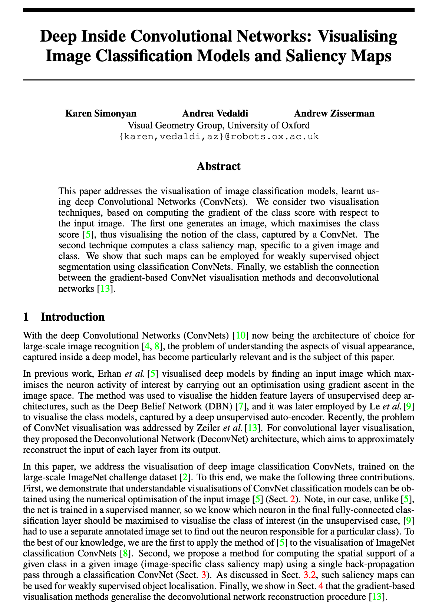
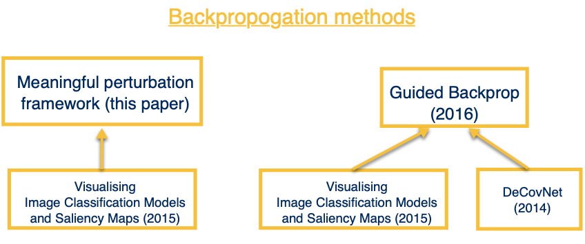

```{r xaringan-themer, include = FALSE, warning=FALSE}
library(xaringanthemer)
style_duo_accent(
  primary_color = "#002F6C",
  secondary_color = "#FFC600",
  inverse_header_color = "#FFFFFF",
  header_font_google = google_font("Josefin Sans"),
  text_font_google   = google_font("Montserrat", "300", "300i"),
  code_font_google   = google_font("Droid Mono"),
)
```

# Objectives

- Identify the contributions made by this paper

- Recall existing approaches to explaining classifiers & their limitations

- Understand proposed framework of explanations (contribution #1)

- Understand pitfalls in designing automatic explanation systems (contribution #2)

- Understand how network saliency is interpreted in proposed framework (contribution #3)

- Application of framework


---
## Main Contributions

1. Framework of explanations as *meta-predictors* (#1)  

--

1. *Pitfalls* in designing automatic explanation systems (#2)  

--

1. *Reinterpret* network saliency in proposed framework (#3)  


???
1.Meta-predictors coming from meta-learning which is when an algorithm requires other algorithms that have already been trained on data to make predictions. At a high level, the authors propose a general framework that uses explanations from other techniques as meta-predictors.

2. 
 
---
## Recap `r emo::ji("airplane")`

.pull-left[

*Saliency Maps*: process images to distinguish visual features in images (e.g. converting colored images to black and white, infrared)

Terms to know: 
  - *activation function*: checks to see if the computed weighted sum of inputs is above a required threshold (e.g. softmax, ReLu)
    - *activation maps*: visual representation of activation numbers at various layers of the network to understand which parts of the image contributed to the output
  - *backpropogation*: method to make neural networks self-improving when actual output is different than expected output
]

.pull-right[



]

???
Before we take off, let's take a moment to review the safety information card located in your seatback pocket. 
This paper builds on their 2015 paper, one of the first instances of saliency maps being used to visualize image classification models.  
Saliency maps process images to differentiate visual features in images. For example, coloured images are converted to black-and-white images in order to analyse the strongest colours present in them. Other instances would be using infrared to detect temperature (red colour is hot and blue is cold) and night vision to detect light sources(green is bright and black is dark).

When neural networks are trained, a range of inputs are passed along with corresponding expected output. Activation functions help decide whether a neuron should be activated. This helps determine whether the information that the neuron is receiving is relevant for the input if it pass a certain threshold.

Ideally you want an optimal NN where the expected results and the actual results are within the error threshold. However occasionally, the expected output is different than the actual output. As a consequence, information is fed back into the network and the weights and biases are enhanced. This process is recursive in nature and is known as back propagation.

---
## Backbone of proposed work

.pull-left[


]

.pull-right[

- Proposed framework = learned masking  
  - 2015 - gradient based saliency 
  - Pixel's contribution is based on the gradient of the prediction w.r.t the input features
  
- Guided Backprop  
  - Gradient based saliency + DeConvNet (only positive error signals)  
  - DeConvNet only backpropogates positive error signals
  - Produces sharper visualizations

]

???
This work builds upon and compares the output some of the various works done to interpret image classifications.
The three methods here are closely related methohds for creating saliency maps. The main difference is how they backpropogate thru the linear rectifier (ReLU).

at it's core, this paper is based on their 2015 work developing gradient based saliency maps (there's more but i will get to that later). What is gradient-based?
gradient-based saliency - meaning - if I were to change change a certain pixel, the predicted class probability would go up or down depending on the value of the gradient. The larger the gradient the stronger the effect of change at the pixel.

then there is guided backprop = gradient based saliency + deconvolution aka deconvnet. 
Deconvnet is almost identical to "vanilla gradient" except for a reversal of the activation layer. Deconvnet backpropogates the gradient through ReLU and sets negative values in a layer to 0.

Guided Backprop - combines backpropagation and DeconvNets when handling the ReLU. Like DeconvNets, in Guided Backpropagation we only backpropagate positive error signals – i.e. we set the negative gradients to zero. But, we also restrict to backpropogate to only positive inputs. So here, the gradient is "guided" by both the input and the error signal.

---
## Charateristics

.pull-left[


.footnote[*abc]
]

.pull-right[


]

???

---
class: inverse center middle

# blah

---
## Speech Recognition


.pull-left[

.footnote[1.abc]  
]

.pull-right[


.footnote[2.abc]
]

???

---
class: inverse center middle

# blah

---
## Vocabulary


???


---
## Similarity 


???

---
## Adaptation


???

---
## Case Base


???

---
class: inverse center middle

# blah

---
## Dialogue Management for CCBR

.pull-left[


]

.pull-right[

]

???

---
## References

```{r, load_refs, echo=FALSE, message=FALSE}
# library(RefManageR)
# bib <- ReadBib("./assets/S0933365711000480.bib", check = FALSE)
# ui <- "- "
```

```{r, print_refs, results='asis', echo=FALSE, warning=FALSE, message=FALSE}
# writeLines(ui)
# print(bib[key = "MCSHERRY201159"], 
#   .opts = list(check.entries = FALSE, 
#                style = "html", 
#                bib.style = "authoryear"))
```

