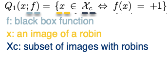

```{r xaringan-themer, include = FALSE, warning=FALSE}
library(xaringanthemer)
style_duo_accent(
  primary_color = "#002F6C",
  secondary_color = "#FFC600",
  inverse_header_color = "#FFFFFF",
  header_font_google = google_font("Josefin Sans"),
  text_font_google   = google_font("Montserrat", "300", "300i"),
  code_font_google   = google_font("Droid Mono"),
)
```

# Objectives

- Identify the contributions made by this paper

- Recall existing approaches to explaining classifiers & their limitations

- Understand proposed framework of explanations (contribution #1)

- Understand pitfalls in designing automatic explanation systems (contribution #2)

- Understand how network saliency is interpreted in proposed framework (contribution #3)

- Application of framework


---
## Main Contributions

1. Framework of explanations as *meta-predictors* (#1)  

--

1. *Pitfalls* in designing automatic explanation systems (#2)  

--

1. *Reinterpret* network saliency in proposed framework (#3)  


???
1.Meta-predictors coming from meta-learning which is when an algorithm requires other algorithms that have already been trained on data to make predictions. At a high level, the authors propose a general framework that uses explanations from other techniques as meta-predictors.

2. 
 
---
## Recap `r emo::ji("airplane")`

.pull-left[

Terms to know:   

- *Image perturbation*: slightly altering an image as reduce overfitting an image classifier  
  - offset
  - good practice  
- *Saliency maps*: process images to distinguish visual features in images (e.g. converting colored images to black and white, infrared)
- *Activation function*: checks to see if the computed weighted sum of inputs is above a required threshold (e.g. softmax, ReLu)
  - *Activation maps*: visual representation of activation numbers at various layers of the network to understand which parts of the image contributed to the output
- *Backpropogation*: method to make neural networks self-improving when actual output is different than expected output  

]

.pull-right[


]

???
Before we take off, let's take a moment to review the safety information card located in your seatback pocket. 
This paper builds on their 2015 paper, one of the first instances of saliency maps being used to visualize image classification models.  

image perturbation means to slightly alter an image to reduce the chances of overfitting an image classifier. why? we offset so that in case you get any variant images (slightly cutoff or not centered) during testing and its good practice for a robust classifier. 

Saliency maps process images to differentiate visual features in images. For example, coloured images are converted to black-and-white images in order to analyse the strongest colours present in them. Other instances would be using infrared to detect temperature (red colour is hot and blue is cold) and night vision to detect light sources(green is bright and black is dark).

When neural networks are trained, a range of inputs are passed along with corresponding expected output. Activation functions help decide whether a neuron should be activated. This helps determine whether the information that the neuron is receiving is relevant for the input if it pass a certain threshold.

Ideally you want an optimal NN where the expected results and the actual results are within the error threshold. However occasionally, the expected output is different than the actual output. As a consequence, information is fed back into the network and the weights and biases are enhanced. This process is recursive in nature and is known as back propagation.

relu: piecewise linear function that will output the input directly if it is positive, otherwise, it will output zero.
---
## Backbone of proposed work

.pull-left[


]

.pull-right[

- Proposed framework = learned masking  
  - 2015 - gradient based saliency 
  - Pixel's contribution is based on the gradient of the prediction w.r.t the input features
  
- Guided Backprop (2016)  
  - Gradient based saliency + DeConvNet (only positive error signals)  
  - DeConvNet only backpropogates positive error signals
  - Produces sharper visualizations

]

???
This work builds upon and compares the output some of the various works done to interpret image classifications.
The three methods here are closely related methohds for creating saliency maps. The main difference is how they backpropogate thru the linear rectifier (ReLU).

at it's core, this paper is based on their 2015 work developing gradient based saliency maps (there's more but i will get to that later). What is gradient-based?
gradient-based saliency - meaning - if I were to change change a certain pixel, the predicted class probability would go up or down depending on the value of the gradient. The larger the gradient the stronger the effect of change at the pixel.

then there is guided backprop = gradient based saliency + deconvolution aka deconvnet. 
Deconvnet is almost identical to "vanilla gradient" except for a reversal of the activation layer. Deconvnet backpropogates the gradient through ReLU and sets negative values in a layer to 0.

Guided Backprop - combines backpropagation and DeconvNets when handling the ReLU. Like DeconvNets, in Guided Backpropagation we only backpropagate positive error signals – i.e. we set the negative gradients to zero. But, we also restrict to backpropogate to only positive inputs. So here, the gradient is "guided" by both the input and the error signal.

---
## Backbone of proposed work pt.2

.pull-left[


</br>


]

.pull-right[

- Class Activation Mapping (CAM)  
  - Gradient-CAM
  - Gradient is not backpropogated
  
- Layer-wise relevance propogation (LRP) & Excitation Backprop  
  - 

- Limitations:  
  - heuristics
  - not model agnostic (except for gradient-based saliency & LRP)
  - only applicable to certain architectures (e.g. GoogLeNet)

]

???
There are also techniques such as CAM and Grad-CAM. Class activation maps are a technique to get the discriminative image regions used by a CNN to identify a specific class. 

Grad-CAM: Unlike other methods, the gradient is not backpropagated all the way back to the image, but (usually) to the last convolutional layer to produce a coarse localization map that highlights important regions of the image.

LRP and excitation backprop: similar in that they propagate the network weights and neural activation through the network up until the input layer. Difference is that EBP takes a top-down 

Limitations:
1. these methods result in pretty visualizations but introduce heuristic notions of image saliency
2. not model agnostic - most are limited to neural networks
---
class: inverse center middle

# Put it together

---
## This work


.pull-left[

 
]

.pull-right[


Parts:
 
1. Explanations as meta-predictors  
1. Local explanation paradigm  
1. Gradient based saliency
1. Feedback CNN architecture 
]

???
Finally, this paper builds on four main works:
 
a paper in 2015 proposing explanations as predictors whereas here they use them as meta--predictors
a 2016 paper introducing Local Interpretable Model-Agnostic Explanation (LIME) but adds that LIME takes too long to converge and were able to reduce the number of iterations.  
a Feedback CNN architecture:
---
class: inverse center middle

# Explanations

---
## Explanations as meta-predictors

- Meta-Learning = learns how best to use predictions from other algorithms to make predictions

.pull-left[
**Explanation rule for robin classifier:**



**Expected prediction error of classifier:**


]

.pull-right[

**Learning Explanations:**

Regularized empirical risk minimization:


Goals:
1. Explanation (Q) is generalizable  
1. Q is simple, thus more interpretable
]
???
Meta = level above
meta-learning = an algorithm that requires other algorithms that have already been trained on data

indicator function can be thought of like a switch - yes if event happened, no if it didn't. 
Q alone isn't very insightful. but we know it is interpretable because we know Xc is - f was trained as a robin classifier, 

we have the rule and prediction error, but how are explanations learned?
the idea is that the prediction error can be measured as prediction accuracy therefore an ML algorithm can be employed to discover explanations by finding rules out of a pool of rules that apply to a certain classifier. This is similar to a traditional learning problem, specifically a regularized empirical risk minimization function. 

RERM - regularizers measure the sensitivity of an attribute of a predictor - in this case the explanation. we want the explanations to be as generalizable as possible. This 

---
## Why is this important? 

**Local explanations** 

--

*Linear classifier interpretation:*  


</br>

--
*Then the gradient:*  


</br>

- In linear classification, change is the same regardless of the starting point, x<sub>0</sub>  

--

Suggested approach: 

- Perturbations x obtained by deleting subregions of x<sub>0</sub>  --> masking


???
we know local explanations are rules that predict the response of black box function in a neighborhood of a certain point.  
What was discovered from their previous work on gradient based saliency maps is that their interpretation of the saliency map breaks for linear classifiers. 
If this is the formula to explain a linear classifier then the gradient at point x0 is just equal to some constant w - making it independent of the point x0 thus not interpretable as saliency.

Arbitrary displacements of x0 are important for local explanations, however in linear classification change is the same regardless of where the point started.
---
## Saliency


???

---

class: inverse center middle

# Experiment

---
## blah blah blah

.pull-left[


]

.pull-right[

]

???

---
class: inverse center middle

# Code
---
## References

```{r, load_refs, echo=FALSE, message=FALSE}
# library(RefManageR)
# bib <- ReadBib("./assets/S0933365711000480.bib", check = FALSE)
# ui <- "- "
```

```{r, print_refs, results='asis', echo=FALSE, warning=FALSE, message=FALSE}
# writeLines(ui)
# print(bib[key = "MCSHERRY201159"], 
#   .opts = list(check.entries = FALSE, 
#                style = "html", 
#                bib.style = "authoryear"))
```

